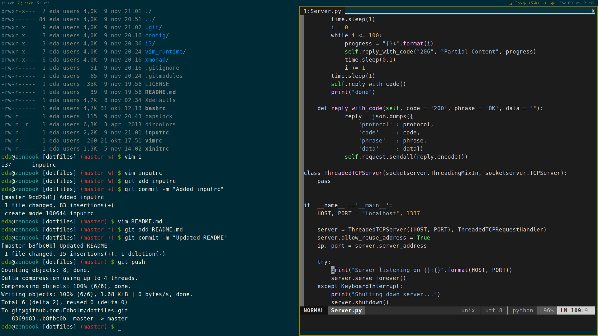
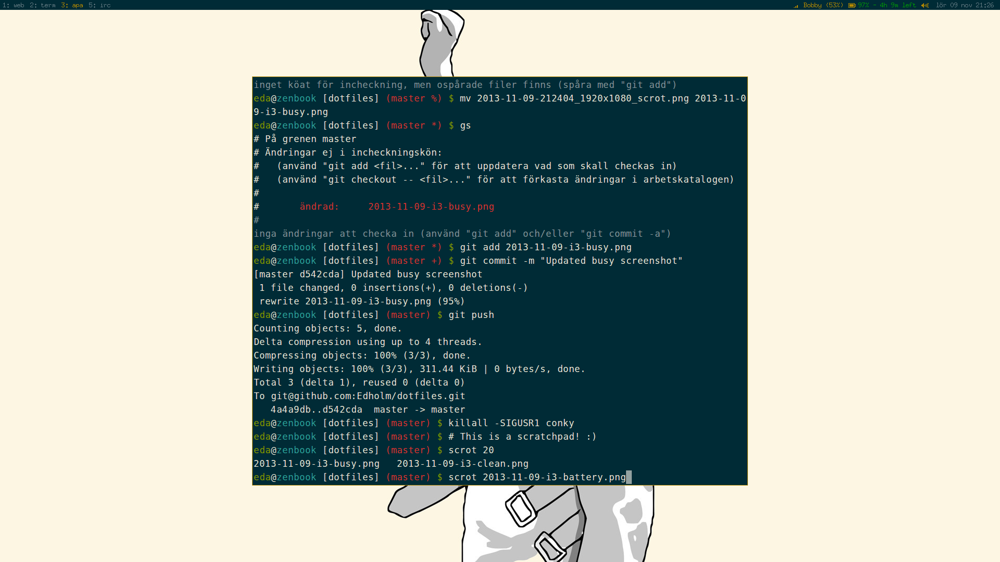

dotfiles
========
My various dotfiles collected over the years from various places across the interweb.

###How to use###
Clone the repo and symlink the files/folders you want to use.

Example:

 ```bash
$ git clone git@github.com:Edholm/dotfiles.git  
$ cd dotfiles  
$ git submodule init     # To fetch the vimrc submodule
$ git submodule update
$ ln -s bashrc ~/.bashrc
$ ln -s xinitrc ~/.xinitrc
$ ln -s i3 ~/.i3
# Etc.
```

###i3###
I use [i3](https://www.archlinux.org/packages/community/x86_64/i3-wm/) with [i3bar-icons-git](https://aur.archlinux.org/packages/i3bar-icons-git/). 
I modified the icon patch to not add spacing after the icons. This makes using only icons a bit nicer.

For status output I use [py3status-git](https://aur.archlinux.org/packages/py3status-git/) with my own custom modules.
#### Screenshot####
Statusbar on AC-power and low CPU usage:  
  
Statusbar on battery and high CPU usage (CPU usage only shows when above certain threshold)  
  

(Note: The below screenshots use _conky_ as status output command)  
My desktop as of 2013-11-09:



On battery (patched i3bar that can show xbm icons)


