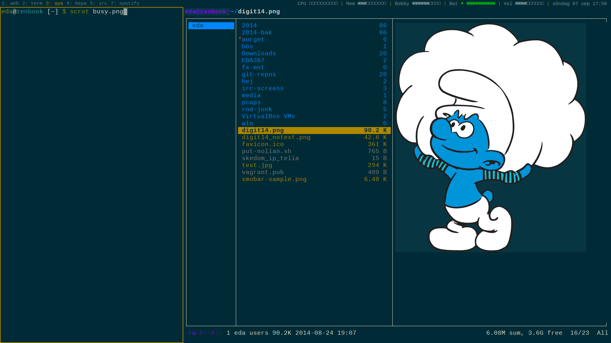

dotfiles
========
My various dotfiles collected over the years from various places across the interweb.

###How to use###
Clone the repo and symlink the files/folders you want to use.

Example:

 ```bash
$ git clone git@github.com:Edholm/dotfiles.git  
$ cd dotfiles
$ ln -s bashrc ~/.bashrc
$ ln -s xinitrc ~/.xinitrc
$ ln -s i3 ~/.i3
# Etc.
```

###i3###
I use [i3](https://www.archlinux.org/packages/community/x86_64/i3-wm/) with i3bar and conky. 

#### Screenshot####
Busy:
  

Clean:
  

####zsh####
If you want to use my zsh config. Clone my fork of oh-my-zsh first and place zshrc in `~/.zshrc` and the `eda.zsh-theme`
in `~/.oh-my-zsh/custom`
