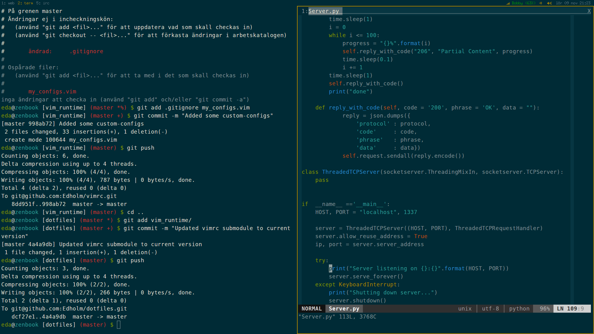

dotfiles
========
My various dotfiles collected over the years from various places across the interweb.

###How to use###
Clone the repo and symlink the files/folders you want to use.

Example:

 ```bash
$ git clone git@github.com:Edholm/dotfiles.git  
$ cd dotfiles  
$ git submodule init     # To fetch the vimrc submodule
$ git submodule update
$ ln -s bashrc ~/.bashrc
$ ln -s xinitrc ~/.xinitrc
# Etc.
```

### Screenshot###
My desktop as of 2013-11-09:



On battery (patched i3bar that can show xbm icons)


